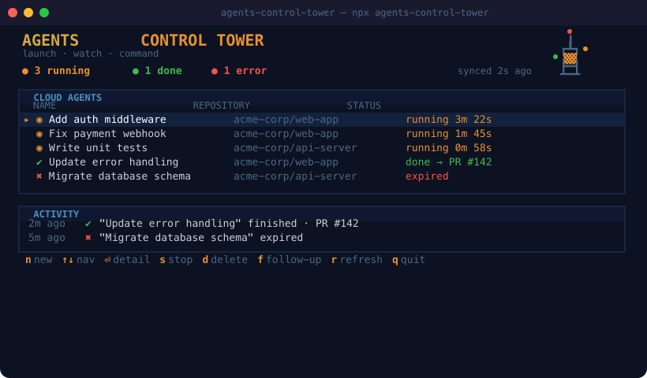
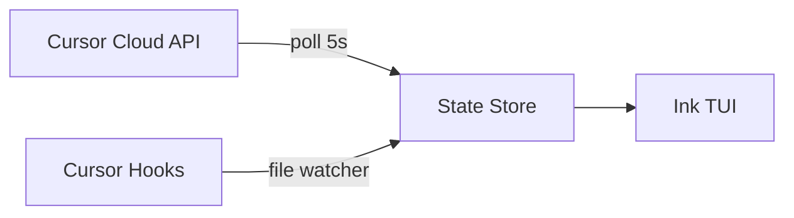

<p align="center">
  
</p>

<h1 align="center">agents-control-tower</h1>

<p align="center">
  <strong>Your Cursor agents are running. Do you know what they're doing?</strong>
</p>

<p align="center">
  Five cloud agents in parallel. One is stuck. One finished and opened a PR.<br>
  One errored out 10 minutes ago and you didn't notice.<br>
  You're alt-tabbing between browser tabs trying to keep track.
</p>

<p align="center">
  <em>Welcome aboard the control tower. One terminal. All your agents. Full control.</em>
</p>

<p align="center">
  <a href="#install"></a>
  &nbsp;
  <a href="#install"></a>
  &nbsp;
  <a href="#the-dashboard"></a>
</p>

<p align="center">
  <a href="https://github.com/ofershap/agents-control-tower/actions/workflows/ci.yml"></a>
  <a href="https://opensource.org/licenses/MIT"></a>
  <a href="https://www.typescriptlang.org/"></a>
  <a href="https://github.com/ofershap/agents-control-tower/stargazers"></a>
  <a href="https://github.com/ofershap/agents-control-tower/pulls"></a>
</p>

---

## The Tower Is Watching

You launched a Cursor cloud agent 20 minutes ago. Did it finish? Did it open a PR? Did it crash?

Your options right now:
- Open cursor.com, find the agents page, scroll, click, read
- Check your email for a notification that may or may not come
- Hope for the best

`agents-control-tower` is a retro terminal dashboard that connects to the Cursor Cloud Agents API and shows you everything in one screen. Launch new agents, send follow-up instructions, stop runaway agents, delete finished ones. All without leaving your terminal.

```bash
npx agents-control-tower
```

One command. The tower lights up.

---

<a id="the-dashboard"></a>

## The Dashboard

<p align="center">
  
</p>

Running agents pulse amber. Done agents link to their PR. Errors glow red.

---

## What's Different

| | Cursor web dashboard | Conduit | SwarmClaw | agents-control-tower |
|---|---|---|---|---|
| Cursor-native | yes | no | no | yes |
| Terminal UI | no | yes | no | yes |
| Launch agents | no | no | partial | yes |
| Follow-up / stop / delete | no | no | no | yes |
| Local agent hooks | no | no | no | Phase 2 |
| Retro ASCII aesthetic | no | no | no | yes |
| One command install | n/a | yes | no | yes |

---

## What You Can Do

| Key | Action | |
|-----|--------|-|
| `n` | Launch a new cloud agent | Pick repo, write prompt, choose model |
| `f` | Send follow-up | Give a running agent new instructions |
| `s` | Stop an agent | Kill it mid-run |
| `d` | Delete an agent | Remove permanently |
| `o` | Open in browser | Jump to the PR or agent URL |
| `enter` | View details | Full conversation, metadata, status |
| `↑↓` / `jk` | Navigate | Move between agents |
| `r` | Refresh | Force sync with Cursor API |
| `c` | Reconfigure | Re-run setup wizard |

The dashboard polls every 5 seconds. Scroll through agents with arrow keys, view full agent messages with scrollable detail view.

---

## Install

Run directly with npx (nothing to install):

```bash
npx agents-control-tower
```

Or install globally for a shorter command:

```bash
npm install -g agents-control-tower
act
```

Both `agents-control-tower` and `act` work after global install.

First run asks for your Cursor API key. Grab one from [cursor.com/dashboard - Integrations](https://cursor.com/dashboard?tab=integrations). Saved to `~/.agents-control-tower/config.json`.

Or pass it as an env var:

```bash
CURSOR_API_KEY=sk-... act
```

---

## How It Works

| Source | What | How |
|--------|------|-----|
| Cursor Cloud API | List, launch, stop, delete agents. Read conversations | REST, polled every 5s |
| Cursor Hooks (coming) | Local IDE sessions, file edits, shell commands | File-based event stream |



### Tech Stack

| | |
|---|---|
|  | TUI framework |
|  | Type safety |
|  | Runtime |
|  | Bundler |
|  | Tests |

---

## Screens

Launch wizard - 3 steps: pick repo (with fuzzy filter), write the task prompt, select model and launch.

Agent detail - repo, branch, PR link, the prompt you gave it, and the full agent response with scroll.

Follow-up - send new instructions to a running agent without leaving the terminal.

Stop / Delete - inline confirmation. Press `s` or `d`, then `y`.

---

## Keyboard Map

```
 DASHBOARD                          DETAIL VIEW
 ──────────────────────────         ──────────────────────────
 n         launch new agent         esc       back to dashboard
 ↑ / k     move up                  f         send follow-up
 ↓ / j     move down                s         stop agent
 enter     open detail              d         delete agent
 s         stop selected            o         open PR / URL
 d         delete selected          ↑↓        scroll message
 r         force refresh
 q         quit                    LAUNCH FLOW
                                    ──────────────────────────
 GLOBAL                             ↑↓        navigate options
 ──────────────────────────         /         filter repos
 ctrl+c    quit immediately         enter     select / confirm
 c         reconfigure              esc       cancel / go back
```

---

## Contributing

Contributions welcome. See [CONTRIBUTING.md](CONTRIBUTING.md) for setup.

---

## Author

[](https://gitshow.dev/ofershap)

[](https://linkedin.com/in/ofershap)
[](https://github.com/ofershap)

---

If this helped you, [star the repo](https://github.com/ofershap/agents-control-tower), [open an issue](https://github.com/ofershap/agents-control-tower/issues) if something breaks.

## License

[MIT](LICENSE) &copy; [Ofer Shapira](https://github.com/ofershap)
