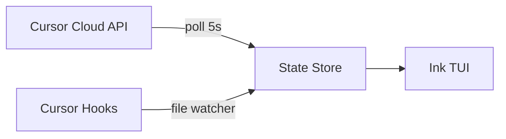

<p align="center">
  
</p>

<h1 align="center">agents-control-tower</h1>

<p align="center">
  <strong>Your Cursor agents are running. Do you know what they're doing?</strong>
</p>

<p align="center">
  <a href="https://github.com/ofershap/agents-control-tower/actions/workflows/ci.yml"></a>
  <a href="https://opensource.org/licenses/MIT"></a>
  <a href="https://www.typescriptlang.org/"></a>
  <a href="https://github.com/ofershap/agents-control-tower/stargazers"></a>
</p>

```bash
npx agents-control-tower
```

One command. The tower lights up. Run it from any directory.

<p align="center">
  
</p>

Running agents pulse amber. Finished agents show their PR link. Errors glow red. The tower icon lights up based on fleet status — amber when agents are active, green when all done, red when something failed.

---

## What You Can Do

Not just a viewer. Launch agents, send follow-ups, stop runaways, delete old ones. All from one terminal.

| Key | Action | |
|-----|--------|-|
| `n` | Launch a new cloud agent | Pick repo, write prompt, choose model |
| `f` | Send follow-up | Give a running agent new instructions |
| `s` | Stop an agent | Kill it mid-flight |
| `d` | Delete an agent | Permanently remove |
| `o` | Open in browser | Jump to the PR or agent URL |
| `enter` | View details | Full conversation, metadata, status |
| `r` | Refresh | Force a sync with Cursor API |

---

## Install

**Zero install** — run directly with npx:

```bash
npx agents-control-tower
```

**Global install** — get the `agents-control-tower` command (and the short alias `act`) available everywhere:

```bash
npm install -g agents-control-tower
act
```

On first run, the setup wizard asks for your Cursor API key. Get one at [cursor.com/dashboard → Integrations](https://cursor.com/dashboard?tab=integrations). The key is saved to `~/.agents-control-tower/config.json`.

Or set it as an env var:

```bash
CURSOR_API_KEY=sk-... act
```

---

## How It Works

| Source | What | How |
|--------|------|-----|
| Cursor Cloud API | List, launch, stop, delete agents. Get conversations and artifacts | REST API, polled every 5s |
| Cursor Hooks (Phase 2) | See local IDE agent sessions, file edits, shell commands | File-based event stream |



Built with [Ink 5](https://github.com/vadimdemedes/ink) (React for CLIs), TypeScript strict, Node.js ≥ 20.

---

## Screens

**Launch wizard** — 3 steps: pick repo (with fuzzy filter), write the task prompt, select model and launch.

**Agent detail** — Repo, branch, PR link, the prompt you gave it, and the latest message from the agent.

**Follow-up** — Send new instructions to a running agent without leaving the terminal.

**Stop / Delete** — Inline confirmation. Press `s` or `d`, hit `y`.

---

## Keyboard Map

```
 DASHBOARD                          DETAIL VIEW
 ──────────────────────────         ──────────────────────────
 n         launch new agent         esc       back to dashboard
 ↑ / k     move up                  f         send follow-up
 ↓ / j     move down                s         stop agent
 enter     open detail              d         delete agent
 s         stop selected            o         open PR / URL
 d         delete selected
 r         force refresh            LAUNCH FLOW
 q         quit                     ──────────────────────────
                                    ↑↓        navigate options
 GLOBAL                             /         filter repos
 ──────────────────────────         enter     select / confirm
 ctrl+c    quit immediately         esc       cancel / go back
 c         reconfigure
```

---

## Contributing

Contributions are welcome. See [CONTRIBUTING.md](CONTRIBUTING.md) for setup instructions.

---

## Author

[](https://gitshow.dev/ofershap)

[](https://linkedin.com/in/ofershap)
[](https://github.com/ofershap)

## License

[MIT](LICENSE) © [Ofer Shapira](https://github.com/ofershap)
