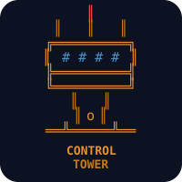

<p align="center">
  
</p>

<h1 align="center">agents-control-tower</h1>

<p align="center">
  <strong>Your Cursor agents are running. Do you know what they're doing?</strong>
</p>

<p align="center">
  Five cloud agents in parallel. One is stuck. One finished and opened a PR.<br>
  One errored out 10 minutes ago and you didn't notice.<br>
  You're alt-tabbing between browser tabs trying to keep track.
</p>

<p align="center">
  <em>One terminal. All your agents. Full control.</em>
</p>

<p align="center">
  <a href="#quick-start"></a>
  &nbsp;
  <a href="#quick-start"></a>
  &nbsp;
  <a href="#the-dashboard"></a>
</p>

<p align="center">
  <a href="https://github.com/ofershap/agents-control-tower/actions/workflows/ci.yml"></a>
  <a href="https://opensource.org/licenses/MIT"></a>
  <a href="https://www.typescriptlang.org/"></a>
  <a href="https://github.com/ofershap/agents-control-tower/stargazers"></a>
  <a href="https://github.com/ofershap/agents-control-tower/pulls"></a>
</p>

---

## The Tower Is Watching

You launched a Cursor cloud agent 20 minutes ago. Did it finish? Did it open a PR? Did it crash?

Your options right now:
- Open cursor.com, find the agents page, scroll, click, read
- Check your email for a notification that may or may not come
- Hope for the best

`agents-control-tower` is a retro terminal dashboard that connects to the Cursor Cloud Agents API and shows you everything in one screen. Not just a viewer. You can launch new agents, send follow-up instructions, stop runaway agents, and delete finished ones. All without leaving your terminal.

```bash
npx agents-control-tower
```

That's it. One command. The tower lights up.

---

## What's Different

| | Cursor web dashboard | Conduit | SwarmClaw | **agents-control-tower** |
|---|---|---|---|---|
| Cursor-native | yes | no | no | **yes** |
| Terminal UI | no | yes | no | **yes** |
| Launch agents | no | no | partial | **yes** |
| Follow-up / stop / delete | no | no | no | **yes** |
| Local agent hooks | no | no | no | **Phase 2** |
| Retro ASCII aesthetic | no | no | no | **yes** |
| One command install | n/a | yes | no | **yes** |

---

<a id="what-you-can-do"></a>

## What You Can Do

| Key | Action | |
|-----|--------|-|
| `n` | Launch a new cloud agent | Pick repo, write prompt, choose model |
| `f` | Send follow-up | Give a running agent new instructions |
| `s` | Stop an agent | Kill it mid-flight |
| `d` | Delete an agent | Permanently remove |
| `o` | Open in browser | Jump to the PR or agent URL |
| `enter` | View details | Full conversation, metadata, status |
| `↑↓` / `jk` | Navigate | Move between agents |
| `r` | Refresh | Force a sync with Cursor API |

The dashboard polls every 5 seconds. Running agents pulse amber. Finished agents show their PR link. Errors show what went wrong.

---

## Quick Start

```bash
npx agents-control-tower
```

On first run, the setup wizard asks for your Cursor API key. Get one at [cursor.com/dashboard → Integrations](https://cursor.com/dashboard?tab=integrations). The key is saved to `~/.agents-control-tower/config.json`.

Or set it as an env var:

```bash
CURSOR_API_KEY=sk-... npx agents-control-tower
```

---

## The Dashboard

```
   A G E N T S                                            ╻
   ╔═╗╔═╗╔╗╔╦╗╔═╗╔═╗╔╗                            ╻ ┃ ╻
   ║  ║║ ║║║║ ║╠═╝║ ║║║                           ┏━━┻━━┓
   ║  ║║ ║║╚╝ ║║╚╗║ ║║╚╗                         ┃░▓░░▓░┃
   ╚═╝╚═╝╝ ╚═╝╚═╝╚═╝╚═╝                          ┣━━━━━━┫
   ╔╦╗╔═╗╔╗╔╗╔═╗╔═╗                                ┃ ░░ ┃
   ║ ║║ ║║║║║║╣ ╠═╝                                ┃ ░░ ┃
   ╝ ╚╚═╝╚╩╝╚╚═╝╚═╝                               ┗━━━━┛
   ░░░░ launch · watch · command ░░░░             ━━┻━━━━┻━━

   3 running    1 done    1 error                 synced 2s ago

 ┌─ cloud ──────────────────────────────────────────────────────┐
 │ ▸◉  Add auth middleware       ofershap/myapp       4m 12s   │
 │  ◉  Fix payment webhook       ofershap/myapp       2m 45s   │
 │  ✔  Update README             ofershap/tools   done → PR #42│
 │  ✖  Refactor DB queries       ofershap/api    error: tests  │
 └──────────────────────────────────────────────────────────────┘

 ┌─ activity ───────────────────────────────────────────────────┐
 │  2m ago   ✔  "Update README" finished · PR #42 created      │
 │  4m ago   ◉  "Fix payment" started on ofershap/myapp        │
 └──────────────────────────────────────────────────────────────┘

 n new agent  ↑↓ navigate  enter details  s stop  d delete  q quit
```

The header has a pixel-art control tower with blinking antenna lights, a radar sweep in the observation deck, and orbiting dots for each running agent. The tower glows amber when agents are active, green when all are done, and red when something failed.

---

<a id="how-it-works"></a>

## How It Works

The tower talks to two data sources:

| Source | What | How |
|--------|------|-----|
| Cursor Cloud API | List, launch, stop, delete agents. Get conversations and artifacts | REST API, polled every 5s |
| Cursor Hooks (Phase 2) | See local IDE agent sessions, file edits, shell commands | File-based event stream |

```
  Cursor Cloud API ──→ Poller (5s) ──→ State Store ──→ Ink TUI
  Cursor Hooks     ──→ File Watcher ──→ State Store ──→ Ink TUI
```

### Tech Stack

| | |
|---|---|
|  | TUI framework |
|  | Type safety |
|  | Runtime |
|  | Bundler |
|  | Tests |

---

## Screens

**Launch wizard** - 3 steps: pick repo (with fuzzy filter), write the task prompt, select model and launch. The new agent appears on the dashboard within seconds.

**Agent detail** - Full metadata (repo, branch, base, started time, PR link), the prompt you gave it, and the latest message from the agent with scrollable history.

**Follow-up** - Send new instructions to a running agent without leaving the terminal.

**Stop / Delete** - Inline confirmation. Press `s` or `d` on any agent, hit `y` to confirm.

**Setup** - First-run wizard. Paste your API key, optionally install local hooks.

**Error state** - Clear error messages with fix instructions. Auto-retry with backoff.

---

## Keyboard Map

```
 DASHBOARD                          DETAIL VIEW
 ──────────────────────────         ──────────────────────────
 n         launch new agent         esc       back to dashboard
 ↑ / k     move up                  f         send follow-up
 ↓ / j     move down                s         stop agent
 enter     open detail              d         delete agent
 s         stop selected            o         open PR / URL
 d         delete selected
 r         force refresh            LAUNCH FLOW
 q         quit                     ──────────────────────────
 ?         help                     ↑↓        navigate options
                                    /         filter repos
 GLOBAL                             enter     select / confirm
 ──────────────────────────         esc       cancel / go back
 ctrl+c    quit immediately
 c         reconfigure
```

---

## Contributing

Contributions are welcome. See [CONTRIBUTING.md](CONTRIBUTING.md) for setup instructions and guidelines.

---

## Author

[](https://gitshow.dev/ofershap)

[](https://linkedin.com/in/ofershap)
[](https://github.com/ofershap)

## License

[MIT](LICENSE) &copy; [Ofer Shapira](https://github.com/ofershap)
